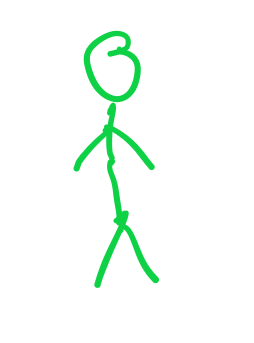

<div align = "center">

## Greetings, mates, I am ErrorDIM - aka [10errordim](https://github.com/10errordim) 👋


<hr>

</div>

<h3>🧬 Programming Languages I Can Use:</h3>

<span align="left">

  

  

  

</span>

<hr>

<h3>🥇 Top Starred Repositories:</h3>

|#|Name|Stars|Size|Major Language|Last Update|Issues and Forks|
|:-:|:---:|:---:|:---:|:---:|:---:|:--:|
|1|**[10errordim](https://github.com/10errordim/10errordim)**|3 ⭐|187.44 MB|Python|2021-08-24T13:39:25Z|0 ⚠  \|  0 🍴|

<hr>

<h3>🤡 About me:</h3>

- 👨‍🎓 I am currently a student, in Grade 11.

- 🔭 I’m currently working on multi-purposed website.

- 💖 Hobbies:
  - 📺 I like anime 
  - 🖌️ I also like to draw 

- ⚡ Fun fact:
<br> ErrorDIM actually stands for ErrorDimension, which was due to how good I was in gaming. It's not a very good name nor nick name. <br> However, I once accidentally said that if I ever be famous, it's definitely this name, so ... 😇😅

- 📫 How to reach me:
  - Gmail: **mrxiaolin2005@gmail.com**
  - Facebook:  **[ErrorDIM](https://facebook.com/errordim)**
  - Instagram:  **[ErrorDIM](https://instagram.com/real.errordim)**

- 🦴 Bonus:

```js
while (me->alive()) {
  me->eat();
  me->code();
  me->sleep();
}  
```

Just kidding, that was just some <kbd>Ctrl</kbd> + <kbd>C</kbd> then <kbd>Ctrl</kbd> + <kbd>V</kbd> shit. <br> It should be `while (me->health() == GOOD and me->awake())`

<hr>

<span style="clear: both">

  <span align="left">⏰ <b>UPDATED:</b> 24/08/2021 09:03:58 PM (GMT+7)</span>
  <span>&emsp;&emsp;&emsp;&emsp;&emsp;&emsp;&emsp;&emsp;&emsp;&emsp;</span>
  <span align="right">⚗ <b>GENERATED:</b> 0.1826s with <a href="https://github.com/10errordim/10errordim/actions" target="_blank">Github Actions</a></span>

</span>
